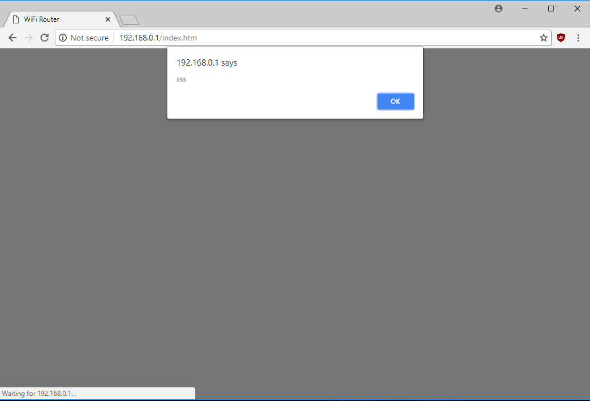

# D-Link DIR-615 XSS Via DHCP #

**Vendor**：D-Link

**Product**: DIR-615

**Version**: 20.07

**Hardware Version**: T1

**Vendor Homepage**: http://us.dlink.com/

**Tested On**: Linux 4.15.0-33-generic #36~16.04.1-Ubuntu x86_64

**CVE**: CVE-2018-15874

## Vulnerability detail ##

Verification Steps:

1. In the [xss_dhcp.py](https://github.com/reevesrs24/cve/blob/master/D-Link_DIR-615/xss_DHCP/xss_dhcp.py) script set the 'interface' and 'mac' variable.
    - Set 'interface' to the network adapter's name
    - Set 'mac' to the network adapter's mac address
2. Set the 'hostname' variable in the dhcp_request function to some arbitrary javascript
    - e.g. 
3. Set the 'siaddr' variable in the dhcp_request function to the D-Link router's local IP address
4. Connect to the router which is undergoing the test
5. Run the python script with **administrator privileges**
6. Navigate to the Status->ActiveClientTable tab in the router admin page to verify that the javascript was uploaded

