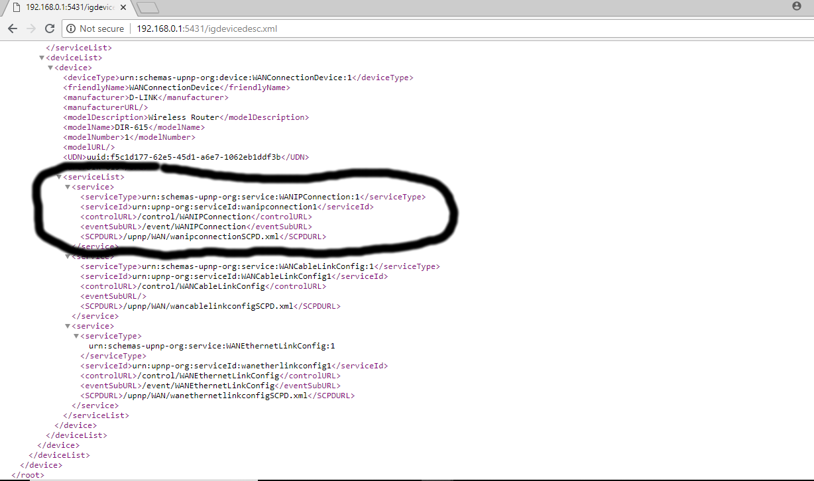
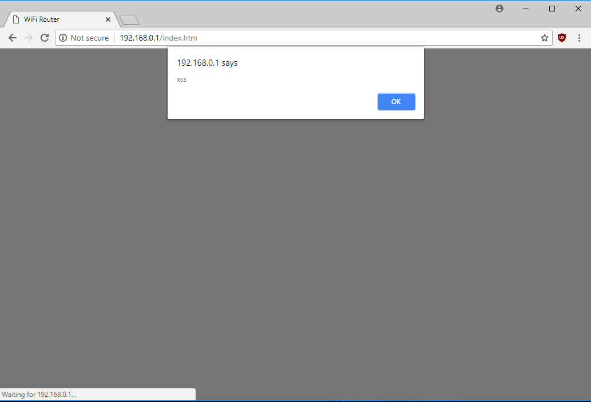

# D-Link DIR-615 XSS Via the UPnP Protocol #

**Vendor**：D-Link

**Product**: DIR-615

**Version**: 20.07

**Hardware Version**: T1

**Vendor Homepage**: http://us.dlink.com/

**Tested On**: Linux 4.15.0-33-generic #36~16.04.1-Ubuntu x86_64

**CVE**: CVE-2018-15875

## Vulnerability detail ##

Verification Steps:

1. Connect to the D-Link DIR-615 router.
2. Run the [xss_upnp.py](https://github.com/reevesrs24/cve/tree/master/D-Link_DIR-615/xss_UPnP/xss_upnp.py) script with the -d switch to start the UPnP "Simple Search Discovery Process". 
   to retrieve the "upnp:rootdevice" uuid.
3. Two results should be displayed to the terminal http:<span></span>//192.168.0.1:5431/igdevicedesc.xml and http:/<span></span>//192.168.0.1:54217/simplecfg.xml.
4. Navigate to http:/<span></span>//192.168.0.1:5431/igdevicedesc.xml to retrieve the UPnP control url
    - **Note:** The port number and xml file may vary depending on the router, look for the "urn:schemas-upnp-org:service:WANIPConnection:1"
      xml element to find the control url.
    
3. Set the 'url' variable in the xss_upnp.py script to the control-url.
    - e.g. http:/<span></span>//192.168.0.1:5431/control/WANIPConnection
4. Set the "NewPortMappingDescription" field in the "add_port_mapping" function to an HTML element where the attribute is javascript.
    - e.g. "" (The <script> tag caused the page to fail to load, but adding javascript to an attribute worked)
5. Run the xss_upnp.py script with the -m switch to add the port mapping.
    - If successful the router should return an xml acknowledgement similar to this
   ```xml
      <?xml version="1.0"?><br/>
        <s:Envelope xmlns:s="http:/<span></span>//schemas.xmlsoap.org/soap/envelope/"><br/>
            <s:Body><br/>
                <u:AddPortMappingResponse xmlns:u="urn:schemas-upnp-org:service:WANIPConnection:1"><br/>
                </u:AddPortMappingResponse><br/>
            </s:Body><br/>
        </s:Envelope>
    ```
6. Navigate to the router's Advanced->UPnP page to verify the xss.
    
